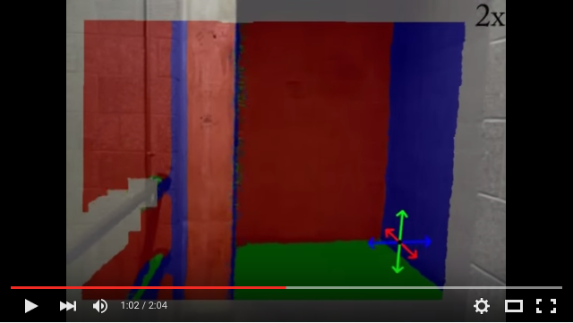

This code extracts the local Manhattan World rotation and segmentation from
depth images in real-time. Here is a demo video for three different
RGB-D sequences:
[](https://youtu.be/5pFEEquUYd8) 

If you are using this code for your research please cite
```
Real-time Manhattan World Rotation Estimation in 3D (Julian Straub,
Nishchal Bhandari, John J. Leonard, John W. Fisher III), In IROS, 2015.
```

### Dependencies

This code depends on the following other libraries and was tested under Ubuntu
14.04. 
- pcl 1.7 (and vtk 5.8)
- Opencv 2 (2.3.1)
- Eigen3 (3.0.5) 
- cuda 5.5 or 6.5 
- Boost (1.52)

The GPU kernels were tested on a Nvidia Quadro K2000M with compute
capability 3.0.

### Install

Once you have those dependencies in place run
```
make checkout && make configure && make 
```
This will checkout dependencies from some of my other repositories ([jsCore](https://github.com/jstraub/jsCore), [mmf](https://github.com/jstraub/mmf), [cudePcl](https://github.com/jstraub/cudaPcl)) and compile
everything to ./build/

### Library
*libcudaPcl.so* collects all the cuda code into one shared library. The rest
of the code is in the form of header files.

### Executables
- *realtimeMF*: infers the Manhattan Frame rotation and implied scene
  segmentation in real-time from depth images. If no input is specified via
  '-i', the program uses openni to grab frames from a connected RGB-D camera.
  The different modes refer to the different underlying models as described in
  the paper (see reference above).
```
Allowed options:
  -h [ --help ]         produce help message
  -m [ --mode ] arg     mode of the rtmf (direct, approx, vmf)
  -i [ --in ] arg       path to input file
  -o [ --out ] arg      path to output file
  -d [ --display ]      display results
  -B [ --B ] arg        B for guided filter
  -T [ --T ] arg        number of iterations
  --eps arg             eps for guided filter
  -f [ --f_d ] arg      focal length of depth camera
  --nCGIter arg         max number of CG iterations
  --dt arg              steplength for linesearch
  --tMax arg            max length for linesearch
```
- *realtimeMF_lcm*: same as realtimeMF except that the RGB-D frames are
  obtained as LCM (https://github.com/lcm-proj/lcm) messages.
```
Allowed options:
  -h [ --help ]         produce help message
  -m [ --mode ] arg     mode of the rtmf (direct, approx, vmf)
  -o [ --out ] arg      path to output file
  -d [ --display ]      display results
  -B [ --B ] arg        B for guided filter
  -T [ --T ] arg        number of iterations
  --eps arg             eps for guided filter
  -f [ --f_d ] arg      focal length of depth camera
  --nCGIter arg         max number of CG iterations
  --dt arg              steplength for linesearch
  --tMax arg            max length for linesearch
```
